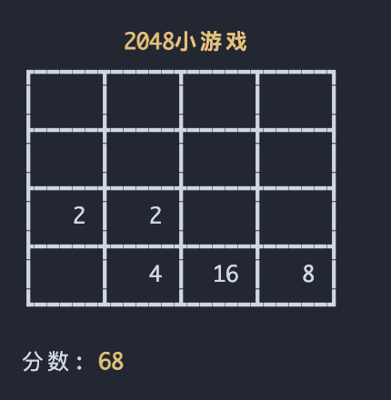
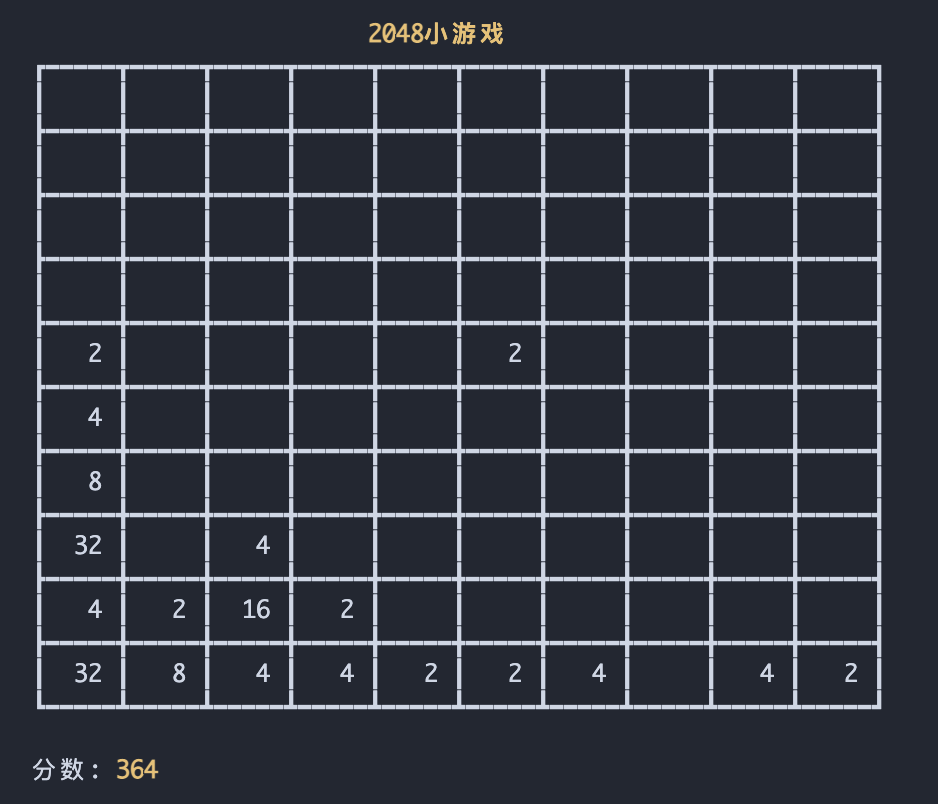

<h1 align="center">2048小游戏-C语言版</h1>
<p align="center">
    
	
	
</p>

### 主函数main.c
```c
int main(int argc, char const *argv[])
{
    init(4); // 地图大小
    play();
    return 0;
}
```

### 头文件game.h
```c
void init(size_t size); //初始化游戏

void show(); // 显示游戏界面

int insert_one(); // 插入一个新的点

void move_group(int *arr[]); // 移动一组

void play(); // 游戏操作

void game_over(); // 游戏结束
```

### 效果图

1. **2048小游戏 (4x4)**



2. **2048小游戏 (10x10)**

